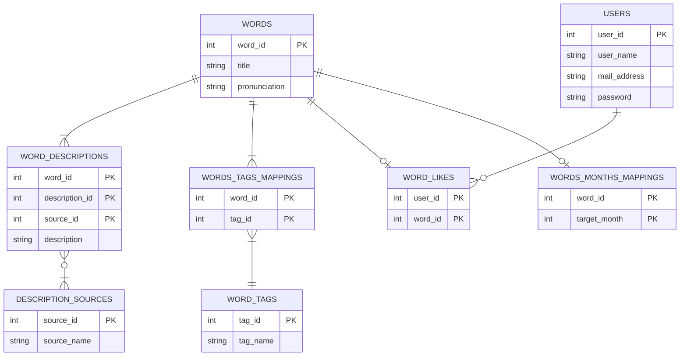

# 茶の湯の銘 図鑑
## 概要
季節に応じて使える茶道の銘を調べるための図鑑です。

茶道では茶碗や茶杓など様々な道具が使われます。有名であったり由緒のある道具には銘という名前のようなものがついています。
茶道の稽古の中で、自分で道具の銘を考える場面があります。そのときに使える銘を調べるための図鑑です。

## 開発動機
- 茶道の稽古の前に一回一回、個人のウェブサイトや本などで銘を調べていたが、ここを見れば大体わかるという統一的な場所がほしかった。
- 月や銘の種類によって絞り込み検索したかった。
- いろいろな銘をざっと簡単に眺められるようにしたかった(かっこいい言葉が多いので眺めているだけでも楽しい)。
- 気に入った銘をお気に入りできるようにしたかった。

## 主な使用技術
- Go 1.22.2
    - gorm v1.25.10
    - gin v1.9.1 
- React 18.2.0
    - vite: 5.2.0
    - react-dom: 18.2.0
    - react-router-dom: 6.21.2
    - react-infinite-scroller: 1.2.6
    - @mui/material: 5.15.16
- Typescript 5.2.2
    - axios: 1.6.8
- MySQL 8.0
- Docker 26.0.0
- Git・GitHub 2.44.0

## 環境
### 開発用
- MacBook Pro(macOS Sonoma 14.4.1)

### 本番用
- Firebase Hosting
- GCP
    - Cloud Run
    - Cloud SQL for MySQL
    - Cloud Build

## プロジェクト管理
Notion
https://bejewled-jaborosa-3c0.notion.site/94b9ffd9212e4b558c660ddda3815ce2?pvs=4

## メイン機能
- 単語の一覧表示
- 単語の詳細表示
- 月単位での絞り込み
- タグ単位での絞り込み
- 単語名称での絞り込み

機能の一覧は[プロジェクト管理](https://bejewled-jaborosa-3c0.notion.site/94b9ffd9212e4b558c660ddda3815ce2?pvs=4)参照

## システム構成

## 画面設計

## API設計
[茶の湯の銘図鑑_API.yaml](./docs/茶の湯の銘図鑑_API.yaml)参照。

## DB設計

